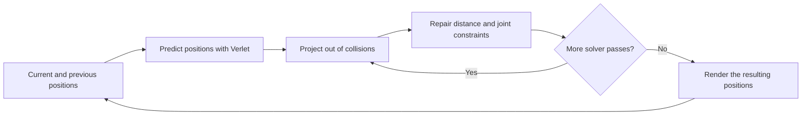
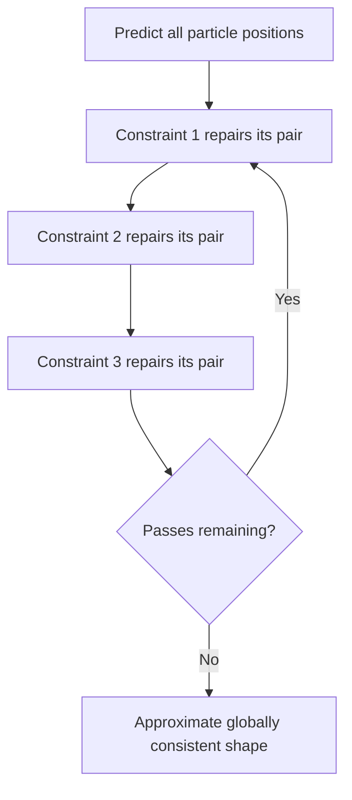

# Advanced Character Physics, Explained

A practical, beginner-friendly guide to Thomas Jakobsen's particle-based physics method

> This chapter explains the ideas in Thomas Jakobsen's paper *Advanced Character Physics* (2001) in new, plain-language wording. It follows the paper's main topics, corrects OCR-damaged equations, and uses Python examples. The runnable cloth program uses `pygame-ce`, which this project already depends on.

## Table of Contents

1. [The big idea](#1-the-big-idea)
2. [Particles without stored velocity](#2-particles-without-stored-velocity)
3. [Verlet integration, carefully](#3-verlet-integration-carefully)
4. [Collision by projection](#4-collision-by-projection)
5. [Distance constraints and relaxation](#5-distance-constraints-and-relaxation)
6. [A fast approximate constraint correction](#6-a-fast-approximate-constraint-correction)
7. [Building cloth](#7-building-cloth)
8. [Rigid bodies made from particles](#8-rigid-bodies-made-from-particles)
9. [Collisions on a body, not just at its particles](#9-collisions-on-a-body-not-just-at-its-particles)
10. [Articulated bodies and character rigs](#10-articulated-bodies-and-character-rigs)
11. [Motion control, friction, and practical details](#11-motion-control-friction-and-practical-details)
12. [A complete runnable cloth example](#12-a-complete-runnable-cloth-example)
13. [What this method is good at, and where it struggles](#13-what-this-method-is-good-at-and-where-it-struggles)
14. [Glossary of jargon](#14-glossary-of-jargon)
15. [Suggested learning path](#15-suggested-learning-path)
16. [Reference](#16-reference)

---

## 1. The big idea

A real-time game simulation has a limited amount of time to update the world for each image on screen. It does not need to reproduce nature perfectly; it needs to look believable, stay stable, and run quickly.

Jakobsen's method represents objects as **particles** (points with positions) connected by **constraints** (rules about where those points may be). Each frame, the program:

1. Predicts where every particle will move.
2. Repairs positions that violate rules, such as a stick becoming too long or a point going through a wall.
3. Repeats the repairs a small number of times.

A constraint is not a spring force. It is a rule that the solver actively tries to satisfy. A distance constraint says, for example, “these two points should remain 100 units apart.” This avoids the stiff springs and tiny time steps that can make ordinary spring simulations unstable.



The method is **iterative**: it improves a result by repeating a simple operation. That makes it possible to trade speed for accuracy. Two solver passes cost less than ten; ten passes will usually make connected shapes hold their form more tightly.

### One picture to keep in mind

Imagine a net made of dots and pieces of string. Gravity moves the dots. Whenever a string gets too long or short, move its endpoints until the string is closer to its intended length. Whenever a dot goes through a wall, move it back to the allowed side. Repeat. That is the core of the method.

---

## 2. Particles without stored velocity

A common simulation stores each particle's position `x` and velocity `v`. Jakobsen's version stores its **current position** `x` and **previous position** `x_old` instead. The difference between them tells us how far it moved during the last step:

```text
implicit displacement = x - x_old
```

For a fixed time step `dt`, the displacement approximates velocity multiplied by time:

```text
velocity ≈ (x - x_old) / dt
```

So velocity has not disappeared; it is encoded in the pair of positions. This is useful because collision and constraint corrections directly change position, and the next step naturally uses that corrected position history.

### Tiny numeric example

Suppose a particle is currently at `x = 10` and was previously at `x_old = 8`. Its last-step displacement was `2` units. With no acceleration, the next prediction is:

```text
x_next = 10 + (10 - 8) = 12
```

The particle continues in the same direction by the same displacement.

### Why initialize the old position correctly?

To give a particle an initial velocity `v0`, initialize:

```python
old_position = position - v0 * dt
```

If current and old positions start equal, the initial displacement is zero, so the particle starts at rest.

---

## 3. Verlet integration, carefully

For constant acceleration `a` and a fixed time step `dt`, the position-based Verlet update is:

$$
x_{next} = x + (x - x_{old}) + a\,dt^2
$$

After calculating the new position, save the former current position as the new history:

$$
x_{old,next} = x
$$

In Python with `pygame.Vector2`:

```python
def verlet_step(position, old_position, acceleration, dt, damping=1.0):
    displacement = (position - old_position) * damping
    next_position = position + displacement + acceleration * dt * dt
    return next_position, position.copy()
```

The `.copy()` matters: `pygame.Vector2` is mutable. If `old_position` refers to the same vector object as `position`, changing one can accidentally change both.

### What damping does

The paper notes that replacing the coefficient 1 on the displacement with a value slightly below 1 introduces drag:

$$
x_{next} = x + d(x - x_{old}) + a\,dt^2, \quad 0 < d \leq 1
$$

Here `d` is a damping factor. For example, `d = 0.99` slowly reduces motion. Damping is a practical artifice: it removes energy and can help motion settle, but too much makes everything sluggish.

### Units and time steps

Be consistent about units. If position is measured in pixels, acceleration should be pixels per second squared and `dt` seconds. The displacement `x - x_old` is then the distance traveled in one simulation step; an initial physical velocity must be multiplied by `dt` when stored as a displacement.

Use a **fixed time step** for the physics. A variable step changes how much time the implicit displacement represents and can make the simulation unstable or inconsistent. A common game loop accumulates real elapsed time and runs zero or more fixed-size physics steps before drawing.

> In a few of the project's early examples, the previous-position difference is treated as a per-frame displacement, while gravity is multiplied by `dt²`. That can be useful for experimentation, but it mixes conventions. The complete example in Section 12 uses seconds consistently.

### Verlet compared with Euler

A basic explicit Euler update stores velocity and does roughly:

```python
velocity += acceleration * dt
position += velocity * dt
```

Position Verlet instead stores position history. Neither formula is magic, and position Verlet is not always more accurate than every velocity-based integrator. Its appeal here is practical: velocity-like motion comes from positions, and projections can correct collisions and constraints without a separate impulse solver.

---

## 4. Collision by projection

A **collision** occurs when objects touch or overlap. A **contact** is a collision that persists, such as a box resting on the floor. This method handles both by correcting positions.

For a point inside a rectangular world, project each coordinate into its allowed range:

```python
def keep_inside_box(position, minimum, maximum):
    position.x = min(max(position.x, minimum.x), maximum.x)
    position.y = min(max(position.y, minimum.y), maximum.y)
```

For example, if a particle's bottom edge is at `y = 610` but the floor is at `y = 600`, replace its `y` with `600`. The point is moved the smallest distance needed to become legal.

```text
Before:   point is below the floor
                    o
-------------------- floor

After:    point is projected onto the floor
                    o
-------------------- floor
```

The history position controls what happens to the implicit velocity. If we set both current and old `y` to the floor, the particle has no vertical displacement next step, corresponding to zero bounce in the normal direction. To add a bounce, change the history position so that the next displacement points away from the floor.

### Why this is simpler than a penalty spring

A penalty method pushes overlapping objects apart using a spring force. A very weak spring allows large overlap; a very stiff spring can make the simulation unstable unless the time step is very small. Projection directly repairs the illegal position, avoiding the need to tune a huge spring constant.

### What projection does not solve by itself

Projecting particle centers works well for simple particles and convex bounds. It does not automatically detect every way a large or non-convex shape can intersect geometry. The collision system must find candidate contacts and, for more complex shapes, provide useful contact points and penetration depths. Section 9 explains how those contacts can move an entire particle-based body.

---

## 5. Distance constraints and relaxation

A distance constraint connects two particles `a` and `b` and asks for a rest distance `L`:

$$
\lVert x_b - x_a \rVert = L
$$

Let `delta = x_b - x_a` and let `distance` be its length. For equal movable masses, split the correction evenly between the two endpoints:

```python
from math import hypot

def satisfy_distance(a, b, rest_length):
    delta = b - a
    distance = hypot(delta.x, delta.y)
    if distance == 0.0:
        return a, b  # Direction is undefined; choose a fallback in a full solver.

    error_fraction = (distance - rest_length) / distance
    correction = delta * (0.5 * error_fraction)
    return a + correction, b - correction
```

If the pair is too far apart, the first endpoint moves toward the second and the second moves toward the first. If they are too close, the correction reverses. After this operation, their distance is exactly the rest length, apart from floating-point rounding.

> The return-value version above makes the directions easy to inspect. A simulation that stores mutable vectors can instead update the two positions in place.

### Unequal masses and fixed particles

The paper handles different masses using **inverse mass**, written `w = 1 / mass`. A larger mass has a smaller inverse mass and therefore moves less. A fixed particle is represented with `w = 0`.

For `delta = b - a`, define `sum_w = w_a + w_b`. The correction is:

$$
c = \frac{\lVert\delta\rVert - L}{\lVert\delta\rVert\,sum_w}\,\delta
$$

$$
a' = a + w_a c, \qquad b' = b - w_b c
$$

Guard against zero distance and against `sum_w == 0` (both endpoints fixed). A fixed point must not move, even if its neighbor does.

### A reusable Python constraint function

```python
def solve_distance(positions, inverse_masses, index_a, index_b, rest_length):
    point_a = positions[index_a]
    point_b = positions[index_b]
    weight_a = inverse_masses[index_a]
    weight_b = inverse_masses[index_b]
    total_weight = weight_a + weight_b

    if total_weight == 0.0:
        return

    delta = point_b - point_a
    distance_squared = delta.length_squared()
    if distance_squared == 0.0:
        return

    distance = distance_squared**0.5
    correction = delta * ((distance - rest_length) / distance)
    point_a += correction * (weight_a / total_weight)
    point_b -= correction * (weight_b / total_weight)
```

### Why solve repeatedly?

Suppose one particle is part of several constraints. Fixing one string can break another. A cloth point might be connected to its left neighbor, right neighbor, upper neighbor, and lower neighbor. The simple solution is to visit constraints repeatedly:

```python
for _ in range(solver_iterations):
    for constraint in constraints:
        solve(constraint)
```

This repeated local repair is called **relaxation**. In the paper, the constraints are satisfied in sequence, so later repairs see earlier changes. This is often called a Gauss-Seidel-style iteration. A method that reads from one unchanged snapshot and writes into a separate buffer is Jacobi-style. Both are iterative solvers, but their convergence and implementation details differ.

Two to ten passes may be enough for a small interactive object; the right number depends on geometry, stiffness, motion, and frame budget. Too few passes can make shapes stretch. More passes cost more time. A common practical improvement is **substepping**: take multiple smaller physics steps per rendered frame, with a modest number of solver passes per step.



Relaxation is not a promise of exact global correctness after a fixed number of passes. It is a useful approximation: each pass tends to reduce local errors, but the whole system may still have some error when the frame ends.

---

## 6. A fast approximate constraint correction

Computing a square root for every constraint can be expensive in a large simulation. The paper describes an approximation that avoids the square root when a constraint is already near its rest length.

With `delta = b - a` and rest length `L`, replace the exact equal-mass correction with:

```python
def satisfy_distance_approx(a, b, rest_length):
    delta = b - a
    distance_squared = delta.length_squared()
    rest_squared = rest_length * rest_length
    denominator = distance_squared + rest_squared

    if denominator == 0.0:
        return a, b

    correction = delta * (rest_squared / denominator - 0.5)
    return a - correction, b + correction
```

When the distance equals the rest length, the multiplier is zero, so no correction occurs. Near the correct distance, this is close to the exact correction. Far from the rest length it is only an approximation, so it may converge differently and should be tested for the particular simulation. Modern hardware may also make the square root inexpensive compared with memory access; measure before optimizing.

The paper's central lesson is not “never use square roots.” It is that a known near-correct answer can sometimes be used to build a cheaper approximation, trading some precision for speed.

---

## 7. Building cloth

A simple cloth mesh can be represented as a grid of particles. Add constraints between neighboring particles. The constraints preserve local spacing, while pins hold selected particles in place.

```text
pin o---o---o---o---o pin
    |   |   |   |   |
    o---o---o---o---o
    |   |   |   |   |
    o---o---o---o---o
```

A grid with `rows` and `columns` has:

- `rows * columns` particles.
- `rows * (columns - 1)` horizontal neighbor constraints.
- `(rows - 1) * columns` vertical neighbor constraints.

The basic grid resists stretching along rows and columns, but it can shear like a parallelogram. Add diagonal **shear constraints** to resist that. Add constraints spanning two or more grid cells, often called **bend constraints**, to resist folding. More constraints make cloth look stiffer, but cost more work and can require more solver passes.

A single pass can produce soft, stretchy cloth. Several passes make the distances more rigid. This gives a useful artistic control as well as a performance control.

### Pinning a particle correctly

A pin can be represented by inverse mass zero. Alternatively, set its position to the target position and set its old position to the same target. Setting both prevents the pin from carrying unintended velocity. If the target itself moves and you want the cloth to inherit that motion, update the old position deliberately instead of always making both positions equal.

### Common cloth problems

- **Exploding or shaking cloth:** check the time step, starting constraint lengths, and zero-distance cases; reduce the step or increase solver passes.
- **Cloth stretches too much:** add solver iterations, substeps, or shear/bend constraints.
- **Cloth looks like a rigid board:** reduce stiffness, remove some long-range constraints, or use fewer iterations.
- **Pinned corners drift:** make pins immovable or reset them after every constraint pass.
- **Cloth falls through a surface:** project particles against the surface during the solver loop and use smaller time steps or continuous/swept collision tests for fast motion.

---

## 8. Rigid bodies made from particles

A 3D rigid body has six degrees of freedom: three for its position and three for its orientation. Jakobsen's paper proposes representing a tetrahedron with four particles and constraining all six edges. The four points provide twelve coordinates; six independent distance constraints leave six degrees of freedom:

$$
4\times 3 - 6 = 6
$$

```text
             p3
            /|\\
           / | \\
          /  |  \\
        p0---|---p2
          \\ |  /
           \\| /
            p1
```

In an implementation, create constraints for every pair of the four particles. Record each edge's initial length as its rest length. During each solver pass, repair collisions and then repair the six lengths. A few passes make the tetrahedron behave approximately rigidly.

This representation avoids explicitly integrating angular velocity, torque, and orientation for the body's core motion. But it has limitations:

- The body is not perfectly rigid when the solver stops after a finite number of passes.
- Four particles make a tetrahedron, not a box-shaped collision surface.
- Particle-only collision tests can miss an intersection when an edge or face passes through geometry but no vertex does.
- The mass distribution and chosen particle layout affect how the body responds.

The paper also suggests other particle arrangements. For example, place particles along three perpendicular axes and constrain both lengths and right angles. The key idea is to choose points and constraints that preserve the shape you want.

---

## 9. Collisions on a body, not just at its particles

To collide a large shape accurately, a collision detector can report:

- A point `p` on the simulated object.
- A point `q` on the obstacle, at the position where contact should occur.
- A direction and penetration depth describing the overlap.

For a stick with endpoints `x1`, `x2`, a point on the stick can be written:

$$
p = c_1x_1 + c_2x_2, \qquad c_1 + c_2 = 1
$$

The coefficients say where the contact lies. If the contact is at endpoint 1, `(c1, c2) = (1, 0)`. If it is one quarter of the way from endpoint 1 to endpoint 2, `(c1, c2) = (0.75, 0.25)`.

Let `delta = q - p`. Moving the endpoints by amounts proportional to their coefficients moves the contact point. For equal particle masses, choose a scalar `lambda` so that the contact reaches `q`:

$$
\lambda = \frac{(q-p)\cdot\delta}{(c_1^2+c_2^2)(\delta\cdot\delta)}
$$

$$
x_1' = x_1 + c_1\lambda\delta, \qquad
x_2' = x_2 + c_2\lambda\delta
$$

For a tetrahedron, use four coefficients, one per vertex. More generally, with contact weights `c_i`, equal masses, and `p = sum(c_i * x_i)`:

$$
\lambda = \frac{(q-p)\cdot\delta}{(\sum_i c_i^2)(\delta\cdot\delta)}, \qquad
x_i' = x_i + c_i\lambda\delta
$$

This derivation assumes the collision system has already found a meaningful contact and that the denominator is nonzero. The distance constraints must be solved again afterward, because moving the body to fix a collision can deform it.

### Unequal masses

If each vertex has inverse mass `w_i`, distribute the correction according to mass:

$$
\lambda = \frac{(q-p)\cdot\delta}{(\sum_i w_i c_i^2)(\delta\cdot\delta)}, \qquad
x_i' = x_i + w_i c_i\lambda\delta
$$

A zero inverse mass means that point does not move. For two dynamic bodies, the contact correction is shared between both bodies according to their inverse masses. This is the same principle as a mass-weighted distance constraint.

### Embedding particles inside a visible shape

The collision shape does not have to match the particle scaffold. A tetrahedron can sit inside a cube or another mesh. For a point on a triangle, compute **barycentric coordinates**: three weights that sum to one and describe the point as a blend of the triangle's vertices. Convert those vertex weights to the scaffold particles' weights, then apply the correction to the scaffold.

This separates two jobs:

- The **render mesh** gives the object its visible shape.
- The **particle scaffold** provides a compact, constraint-driven physical model.

Modern collision systems often use a **broad phase** to quickly find likely object pairs, then a **narrow phase** to compute detailed contact information. Spatial trees and bounding volumes help avoid checking every triangle against every object.

---

## 10. Articulated bodies and character rigs

An **articulated body** is a group of parts connected by joints. In a particle scaffold, parts can share particles:

- Sharing one particle makes a point-like connection, similar to a pin joint.
- Sharing two particles creates a shared axis, similar to a hinge.
- A distance constraint can connect particles that belong to different parts.

Real joints also have limits. A knee should bend mostly one way; elbows should not fold backward indefinitely. The paper describes several ways to express limits as constraints:

- A minimum-distance rule prevents two particles from getting too close.
- An angle rule can be written using a dot product between limb directions.
- A plane constraint keeps a particle on one side of or within a plane.

A dot product compares direction and angle. For vectors `u` and `v`:

$$
u\cdot v = \lVert u\rVert\lVert v\rVert\cos(\theta)
$$

Therefore angle limits can be converted into dot-product limits, with careful handling of vector lengths and the allowed angle range.

Jakobsen's character example uses a simplified stick figure rather than a full rigid body for every limb. Particle positions determine where limbs are; rendering code derives limb orientation from those positions. This skips rotation around a limb's long axis, which can be acceptable for a falling character and much cheaper than simulating every rotational degree of freedom.

### Inverse kinematics (IK)

**Inverse kinematics** means asking the system to place a body part at a target, such as keeping a hand on a doorknob. In this method, pin the hand particle to the target during each relaxation pass. Other connected constraints then pull the arm and body into a compatible pose. An immovable target has inverse mass zero.

This is simple and useful, but it is not a complete animation or joint solver. It may need additional angle limits and careful ordering to produce a natural pose.

---

## 11. Motion control, friction, and practical details

### Applying an impulse or animation motion

Because velocity is encoded by current and old positions, changing the current position changes the next displacement. Moving a particle in the direction of a hit gives it motion. To avoid accidentally adding a velocity spike, distinguish between:

- **Teleporting or pinning:** update both current and old positions.
- **Giving a kick:** change current position relative to old position.
- **Following a moving target:** update the target and decide whether its movement should transfer to the simulated object.

A traditional animation can hand off motion by supplying particle positions from two successive animation frames; their difference becomes the initial Verlet displacement.

### Friction

Projection alone removes motion into a surface, but leaves motion along it. That makes an object slide like it is on ice. A simple friction approximation is:

1. Save the particle's displacement before projection.
2. Split it into normal and tangential parts.
3. Reduce tangential displacement according to friction and penetration depth.
4. Update the old position to encode the reduced displacement.

For a unit surface normal `n` and displacement `v = x - x_old`:

$$
v_n = (v\cdot n)n, \qquad v_t = v-v_n
$$

One simple reduction is:

$$
v_t' = \max\left(0, 1 - \frac{\mu d_p}{\lVert v_t\rVert}\right)v_t
$$

where `mu` is a friction factor and `d_p` is a measure of penetration before projection. Clamp the multiplier at zero so friction does not reverse the sliding direction. Set the old position to `x - (v_n + v_t')` after projection. This is a heuristic, not a full Coulomb friction solver; its behavior depends on how penetration and units are defined.

### Fast motion and tunneling

A fast point can move from one side of a thin wall to the other between updates without ever being detected inside the wall. This is called **tunneling**. Reduce the risk with:

- Smaller fixed steps or multiple substeps.
- Swept tests from the previous to the predicted position.
- A swept sphere/capsule for objects with a radius.
- A sensible maximum speed or time-step limit where appropriate.

A swept test checks the path, not just the final point. The paper describes a simple midpoint-path test as a practical solution for fast objects.

### Numerical singularities

When two constrained particles occupy exactly the same position, their separation direction is undefined. Avoid division by zero. Options include leaving the pair unchanged for that pass, using a known fallback direction, or separating the points slightly. Random nudges can break symmetry, but deterministic fallback directions are easier to reproduce in debugging.

### Rest detection and sleeping

If an object has been nearly still for a while, stop updating it until something wakes it. This is called **sleeping**. It saves work, but the thresholds must avoid putting an object to sleep while it is still visibly moving.

### Soft constraints

A soft constraint repairs only a fraction of its error per pass. If a stick should be 100 units long but is 60, a 50% correction moves it halfway toward the target; later steps close the remaining gap. This creates stretchy or soft-looking material without adding spring forces.

---

## 12. A complete runnable cloth example

This small program uses `pygame-ce`, a fixed time step, position-based Verlet integration, mass-weighted distance constraints, two pinned top corners, gravity, and simple screen-boundary projection. Save it as `cloth_verlet_demo.py` in the project and run it with the project's Python environment.

Install dependency if needed:

```bash
python -m pip install pygame-ce
```

```python
from dataclasses import dataclass

import pygame as pg


@dataclass
class DistanceConstraint:
    a: int
    b: int
    rest_length: float


class Cloth:
    def __init__(self, columns, rows, spacing, origin):
        self.columns = columns
        self.rows = rows
        self.positions = []
        self.previous = []
        self.inverse_masses = []
        self.constraints = []
        origin_x, origin_y = origin

        for row in range(rows):
            for column in range(columns):
                point = pg.Vector2(
                    origin_x + column * spacing,
                    origin_y + row * spacing,
                )
                self.positions.append(point)
                self.previous.append(point.copy())
                self.inverse_masses.append(1.0)

        def index(row, column):
            return row * columns + column

        for row in range(rows):
            for column in range(columns):
                if column + 1 < columns:
                    a = index(row, column)
                    b = index(row, column + 1)
                    self._add_constraint(a, b)
                if row + 1 < rows:
                    a = index(row, column)
                    b = index(row + 1, column)
                    self._add_constraint(a, b)

        self.pin(index(0, 0))
        self.pin(index(0, columns - 1))

    def _add_constraint(self, a, b):
        rest_length = self.positions[a].distance_to(self.positions[b])
        self.constraints.append(DistanceConstraint(a, b, rest_length))

    def pin(self, particle_index):
        self.inverse_masses[particle_index] = 0.0
        self.previous[particle_index] = self.positions[particle_index].copy()

    def step(self, dt, gravity, bounds, solver_iterations=5, damping=0.999):
        left, top, right, bottom = bounds

        for index, position in enumerate(self.positions):
            if self.inverse_masses[index] == 0.0:
                continue

            displacement = (position - self.previous[index]) * damping
            self.previous[index] = position.copy()
            self.positions[index] = position + displacement + gravity * dt * dt

        for _ in range(solver_iterations):
            for constraint in self.constraints:
                self._solve_constraint(constraint)

            for index, position in enumerate(self.positions):
                if self.inverse_masses[index] == 0.0:
                    continue
                position.x = max(left, min(position.x, right))
                position.y = max(top, min(position.y, bottom))

    def _solve_constraint(self, constraint):
        point_a = self.positions[constraint.a]
        point_b = self.positions[constraint.b]
        weight_a = self.inverse_masses[constraint.a]
        weight_b = self.inverse_masses[constraint.b]
        total_weight = weight_a + weight_b

        if total_weight == 0.0:
            return

        delta = point_b - point_a
        distance_squared = delta.length_squared()
        if distance_squared == 0.0:
            return

        distance = distance_squared**0.5
        error_fraction = (distance - constraint.rest_length) / distance
        correction = delta * error_fraction
        point_a += correction * (weight_a / total_weight)
        point_b -= correction * (weight_b / total_weight)

    def draw(self, surface):
        for row in range(self.rows):
            for column in range(self.columns):
                index = row * self.columns + column
                point = self.positions[index]
                if column + 1 < self.columns:
                    neighbor = self.positions[index + 1]
                    pg.draw.line(surface, (126, 176, 184), point, neighbor, 1)
                if row + 1 < self.rows:
                    neighbor = self.positions[index + self.columns]
                    pg.draw.line(surface, (126, 176, 184), point, neighbor, 1)

        for index, position in enumerate(self.positions):
            color = (242, 190, 93) if self.inverse_masses[index] == 0.0 else (232, 239, 226)
            pg.draw.circle(surface, color, position, 3)


def main():
    pg.init()
    width, height = 900, 700
    screen = pg.display.set_mode((width, height))
    pg.display.set_caption("Position-Based Verlet Cloth")
    clock = pg.time.Clock()

    fixed_dt = 1.0 / 120.0
    accumulator = 0.0
    gravity = pg.Vector2(0, 900)
    cloth = Cloth(columns=30, rows=22, spacing=18, origin=(180, 60))
    running = True

    while running:
        frame_time = min(clock.tick(60) / 1000.0, 0.05)
        accumulator += frame_time

        for event in pg.event.get():
            if event.type == pg.QUIT:
                running = False

        while accumulator >= fixed_dt:
            cloth.step(
                fixed_dt,
                gravity,
                bounds=(8, 8, width - 8, height - 8),
                solver_iterations=5,
            )
            accumulator -= fixed_dt

        screen.fill((24, 30, 36))
        cloth.draw(screen)
        pg.display.flip()

    pg.quit()


if __name__ == "__main__":
    main()
```

### Read the example from the inside out

1. Each particle has a current position and a previous position. Their difference is its implicit motion.
2. `step` predicts all movable particles under gravity.
3. Each distance constraint nudges its endpoints toward their original spacing. Inverse mass zero keeps pinned points fixed.
4. The solver repeats those local repairs five times and keeps movable particles inside the screen bounds.
5. The accumulator runs physics at 120 steps per second even if drawing runs at a different rate.

This is deliberately a teaching example, not a production collision system. Its boundary test treats particles as points and does not implement friction, wind, self-collision, diagonal cloth constraints, or swept collision detection. Try adding diagonal constraints, changing `solver_iterations`, or changing `damping` and observe the difference.

---

## 13. What this method is good at, and where it struggles

### Strengths

- Easy to understand and implement.
- Position corrections handle simple collisions and resting contact in one framework.
- Constraints are easy to add: distance, pins, joint limits, and shape-preserving links.
- A small number of iterations often looks convincing in interactive applications.
- The solver can stop early when the frame budget is tight.
- It is a natural fit for cloth, ropes, simple soft bodies, and stylized character motion.

### Limitations and modern practice

- Finite iterations leave residual stretch or shape error.
- Poor time-step choices, bad initial data, or missing guards can still cause instability.
- Collision detection is a major part of the problem; projection cannot fix contacts it never finds.
- Friction and restitution need explicit treatment through the position history or a more advanced solver.
- A particle scaffold may not reproduce the rotational behavior of a conventional rigid-body simulator.
- Large connected systems may converge slowly and need better ordering, substeps, or more sophisticated solvers.

The paper's enduring contribution is the practical combination: infer motion from position history, repair collisions by projection, and handle connected structure with repeated constraint corrections. Each part makes the others useful.

---

## 14. Glossary of jargon

| Term | Plain-English meaning |
|---|---|
| Acceleration | How quickly velocity changes; for gravity, usually a constant downward vector. |
| Articulated body | Multiple body parts connected by joints. |
| Barycentric coordinates | Weights that describe a point inside a triangle as a blend of its three vertices. |
| Bilateral constraint | A rule that must hold as an equality, such as a stick having one exact target length. |
| Broad phase | A quick collision search that finds likely object pairs. |
| Constraint | A rule that limits particle positions or relationships. |
| Contact | A collision that is touching or resting, rather than only a brief impact. |
| Degrees of freedom | Independent ways a system can move. A free 3D rigid body has six. |
| Damping | A deliberate reduction of motion or energy over time. |
| Gauss-Seidel iteration | An iterative method that uses each constraint's updated positions immediately. |
| Implicit velocity | Velocity-like motion represented by the difference between current and previous positions. |
| Inverse kinematics (IK) | Finding a body pose that places a selected part, such as a hand, at a target. |
| Inverse mass | `1 / mass`; controls how much a particle moves when corrected. Zero means fixed. |
| Jacobi iteration | An iterative method that computes updates from a shared old snapshot. |
| Narrow phase | Detailed collision calculations for a candidate object pair. |
| Penetration depth | How far overlapping objects must be separated to reach contact. |
| Projection | Moving an invalid position to the nearest allowed position or surface. |
| Rest length | The target distance between two connected particles. |
| Relaxation | Repeatedly repairing local constraints to approach a globally consistent result. |
| Restitution | Bounciness; how much normal motion remains or reverses after impact. |
| Shear constraint | A cloth constraint that resists sideways distortion, commonly along grid diagonals. |
| Substep | A smaller physics update performed within one rendered frame. |
| Tunneling | Passing through a thin obstacle between two collision checks. |
| Unilateral constraint | A one-sided rule, such as a point staying outside a surface or two points not getting too close. |
| Verlet integration | A position-based integration scheme that uses current and previous positions. |

---

## 15. Suggested learning path

1. Run the cloth example unchanged and identify the current position, previous position, and fixed time step.
2. Change gravity and damping independently. Notice that damping removes motion while gravity adds it.
3. Change solver passes from 1 to 10. Watch how the cloth's edge lengths change.
4. Add diagonal constraints and compare the cloth's resistance to shearing.
5. Add a floor contact and then implement tangential friction by adjusting the previous position.
6. Build a rope as a line of particles, then a small articulated stick figure.
7. Only after these are working, experiment with contact points on rigid particle scaffolds and faster collision detection.

When debugging, draw particles, constraints, pinned points, contact normals, and penetration depths. Visualizing the solver state usually reveals mistakes faster than staring at equations.

---

## 16. Reference

Jakobsen, Thomas. “Advanced Character Physics.” *Proceedings of the Game Developers Conference*, 2001. The paper describes the particle, Verlet, projection, relaxation, cloth, rigid-body, articulated-body, and friction techniques explained in this chapter.
